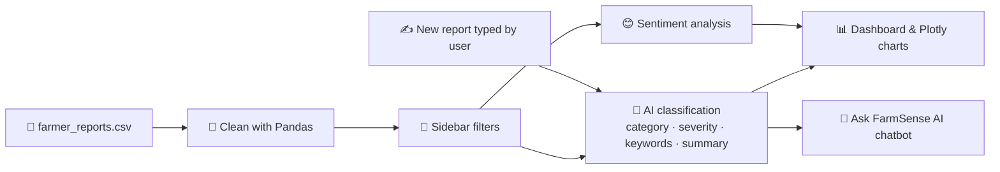

# 🌾 FarmSense AI

### Turning farmers' words into insights

**A GenAI-powered farmer report analyzer built with Streamlit, Pandas, Plotly, and Hugging Face.**

*CS 315 – Application Development and Emerging Technologies · Activity 3*
*Author: John Patrick T. Conwi · North Eastern Mindanao State University (NEMSU)*

---

## 📑 Table of Contents

1. [The Problem](#1-the-problem)
2. [The Solution](#2-the-solution)
3. [Objectives](#3-objectives)
4. [Features](#4-features)
5. [How It Works](#5-how-it-works)
6. [Dataset](#6-dataset)
7. [Technologies Used](#7-technologies-used)
8. [Project Structure](#8-project-structure)
9. [Installation](#9-installation)
10. [Configure the AI Token](#10-configure-the-ai-token)
11. [Run the App](#11-run-the-app)
12. [Deploy to Streamlit Community Cloud](#12-deploy-to-streamlit-community-cloud)
13. [Troubleshooting](#13-troubleshooting)
14. [Future Improvements](#14-future-improvements)
15. [CS 315 Activity 3 Requirements](#15-cs-315-activity-3-requirements)
16. [Dataset Citation](#16-dataset-citation)

---

## 1. The Problem

Farmers describe crop problems in their own words:

> *"The rice leaves have yellow spots and several plants are dying."*

Text like this is hard to count, compare, or act on across a whole town or province. Agricultural offices cannot easily answer questions such as:

- What are the most common problems right now: pests, disease, water, or weather?
- Which crops and which places are hit hardest?
- Which reports are serious enough to need attention first?

## 2. The Solution

**FarmSense AI** reads unstructured farmer reports and converts them into organized, visual, searchable information. It cleans the data, uses AI language models to **classify each report** (category, severity, keywords, summary), measures **sentiment**, shows everything on an **interactive dashboard**, and lets users **ask questions in plain language** through a chatbot that answers only from the real data.

---

## 3. Objectives

**General objective:** To develop a web-based system that uses Generative AI to analyze farmer reports and turn free-text problem descriptions into organized, actionable information.

**Specific objectives:**

1. Load and clean a farmer report dataset using Pandas.
2. Automatically classify each report into a problem category and severity level using AI.
3. Measure the sentiment (urgency/negativity) of each report.
4. Visualize results with an interactive, filterable dashboard.
5. Analyze brand-new reports instantly when a user pastes them in.
6. Answer natural-language questions using only the actual dataset (no invented answers).
7. Handle errors gracefully and be ready for deployment on Streamlit Community Cloud.

---

## 4. Features

| Area | Feature |
|---|---|
| 🧹 **Data cleaning** | Loads a CSV with Pandas; trims whitespace, removes empty rows and duplicates, fixes dates, fills missing values |
| 🔎 **Filtering** | Filter by crop, location, and date range |
| 🧠 **AI classification** | Sorts each report into **Pest, Disease, Water, Weather, Nutrient, or Other**, with severity (**Low / Moderate / High**), keywords, and a short summary |
| 😊 **Sentiment analysis** | Labels each report positive, neutral, or negative using `cardiffnlp/twitter-roberta-base-sentiment-latest` |
| 🔁 **Model fallback** | If the first AI model fails, the app automatically tries the next: Qwen2.5-7B → Qwen3-8B → Llama-3.1-8B |
| 🔌 **Two AI providers** | Hugging Face (cloud) or Ollama (runs locally, no token needed) |
| 💾 **Disk caching** | Saves AI results to `data/ai_cache.json` so reports already analyzed are not sent to the API again |
| 🔄 **Retry button** | Re-run the AI analysis from the sidebar |
| 📊 **Dashboard cards** | Total reports, number of crops, number of locations, most common problem |
| 📈 **Interactive charts** | Plotly charts: reports by crop, by location, problem categories, and sentiment |
| ✍️ **AI Report Analyzer** | Paste a new report and get an instant classification |
| 💬 **"Ask FarmSense AI" chatbot** | Ask questions like *"Which crop has the most pest problems?"*; answers come only from the dataset summary |
| 🛡️ **Error handling** | Friendly messages for a missing file, empty data, missing columns, missing token, API errors, bad AI output, and no internet |
| 🪶 **Works without a token** | The dataset and charts still work; only the AI features are disabled, with a clear message and no fake results |

---

## 5. How It Works



**Step by step**

1. **Load and clean:** `load_and_clean_data()` reads the CSV and removes empty reports and duplicates, trims spaces, converts dates, drops rows with unreadable dates, and labels missing crop/location as "Unknown".
2. **Filter:** the user narrows the data by crop, location, and date.
3. **Analyze:** reports are sent to the AI in small groups. Results are cached, so repeat runs are fast and use fewer API calls.
4. **Visualize:** metric cards and Plotly charts update with the filters.
5. **Ask:** the chatbot receives a summary of the dataset and is instructed to answer **only** from it. If the answer isn't in the data, it says so.

---

## 6. Dataset

**File:** `data/farmer_reports.csv`

| Column | Description |
|---|---|
| `date` | Date the report was submitted (YYYY-MM-DD) |
| `location` | Barangay/town where the report came from |
| `crop` | Crop affected: Rice, Corn, Coconut, Banana, or Vegetables |
| `report` | Free-text description of the problem, in the farmer's own words |

**At a glance**

- **Type:** synthetic (computer-generated) sample data, *not real farmer data*
- **Size:** 50 raw rows → 47 rows after cleaning
- **Coverage:** 5 crops, 8 towns in the Caraga region, reports dated Aug–Oct 2026
- **Generated by:** `gen_data.py` (random seed 7, so it is reproducible)
- **Intentionally messy:** contains an empty report, a duplicate, a missing date, and extra whitespace so the cleaning step has real work to do

You can replace the file with your own data as long as it keeps the same 4 columns.

---

## 7. Technologies Used

| Technology | Purpose |
|---|---|
| **Python 3** | Programming language |
| **Streamlit** | Web app framework and user interface |
| **Pandas** | Data loading and cleaning |
| **Plotly** | Interactive charts |
| **Hugging Face Inference Providers** | GenAI classification, summaries, and chatbot (`Qwen/Qwen2.5-7B-Instruct` → `Qwen/Qwen3-8B` → `meta-llama/Llama-3.1-8B-Instruct`) plus the `cardiffnlp/twitter-roberta-base-sentiment-latest` sentiment model |
| **Ollama** *(optional)* | Run the AI locally on your own computer |
| **Requests** | Calling the AI services |

---

## 8. Project Structure

```
FarmSenseAI/
│
├── app.py                     # Main Streamlit app (UI + dashboard)
├── gen_data.py                # Script that generates the synthetic dataset
├── requirements.txt           # Python packages needed
├── README.md                  # This file
│
├── data/
│   ├── farmer_reports.csv     # The dataset
│   └── ai_cache.json          # Cached AI results (auto-generated)
│
├── utils/
│   ├── __init__.py            # Makes "utils" an importable package
│   └── ai_analysis.py         # All functions that call the AI models
│
├── .streamlit/
│   └── secrets.toml           # Your Hugging Face token (kept private)
│
└── .devcontainer/
    └── devcontainer.json      # Codespaces / dev container setup
```

---

## 9. Installation

Open a terminal (Command Prompt, PowerShell, or Terminal) and run:

```bash
# 1. Move into the project folder
cd path/to/FarmSenseAI

# 2. (Recommended) Create a virtual environment
python -m venv venv

# 3. Activate it
# Windows:
venv\Scripts\activate
# Mac/Linux:
source venv/bin/activate

# 4. Install the required packages
pip install -r requirements.txt
```

---

## 10. Configure the AI Token

1. Go to <https://huggingface.co/settings/tokens> and create a **fine-grained** token with the **"Make calls to Inference Providers"** permission.
2. Open `.streamlit/secrets.toml` and add your token:
   ```toml
   HF_TOKEN = "hf_your_token_here"
   ```
3. Save the file.

> 🔒 **Keep your token private.** Never share `secrets.toml`, paste the token in a chat or document, or upload it to GitHub. The included `.gitignore` already excludes it. If a token was ever exposed, delete and regenerate it at the link above.

**Prefer to run the AI on your own computer?** Install [Ollama](https://ollama.com), run `ollama pull llama3.2:3b`, then choose **Ollama (local)** in the app sidebar. No token is needed, but this only works when the app runs on the same computer (not on Streamlit Cloud).

If you skip this step, the app still runs: the dataset and charts work, and the AI features show a clear message instead of fake results.

---

## 11. Run the App

From inside the `FarmSenseAI` folder, with your virtual environment activated:

```bash
streamlit run app.py
```

Your browser opens `http://localhost:8501`. If it doesn't, copy that address into your browser.

---

## 12. Deploy to Streamlit Community Cloud

1. Create a free account at <https://share.streamlit.io> (sign in with GitHub).
2. Push the project to a GitHub repository:
   ```bash
   git init
   git add .
   git commit -m "Initial commit - FarmSense AI"
   git branch -M main
   git remote add origin https://github.com/your-username/FarmSenseAI.git
   git push -u origin main
   ```
   Because `.streamlit/secrets.toml` is in `.gitignore`, your real token is **not** uploaded.
3. On share.streamlit.io, click **New app**, choose your repository and branch (`main`), and set the main file path to `app.py`.
4. Open **Advanced settings → Secrets** and paste:
   ```toml
   HF_TOKEN = "hf_your_token_here"
   ```
5. Click **Deploy**. Streamlit installs `requirements.txt` and gives you a public URL.

---

## 13. Troubleshooting

| Problem | Likely cause | Solution |
|---|---|---|
| "Could not find the dataset file" | CSV missing or in the wrong place | Put `farmer_reports.csv` inside `data/` |
| "No Hugging Face token found" | `secrets.toml` not set up | Follow [section 10](#10-configure-the-ai-token) |
| "AI request failed" | Invalid token, no internet, or service down | Check your token and connection, then try again |
| `ModuleNotFoundError: No module named 'utils'` | `utils/` folder wasn't pushed to GitHub | Confirm `utils/__init__.py` and `utils/ai_analysis.py` are in the repo, then reboot the app |
| "The AI returned a response that wasn't valid JSON" | Rare AI formatting hiccup | Click Analyze again; the app never crashes, it skips that report |
| App won't start / `ModuleNotFoundError` | Packages not installed | Run `pip install -r requirements.txt` in your virtual environment |
| A chart is empty | Filters are too narrow | Widen the Crop / Location / Date filters in the sidebar |

---

## 14. Future Improvements

- 🗺️ Map view showing where reports come from
- 📤 Upload your own CSV directly in the app
- 🌐 Bisaya/Tagalog report input (multi-language support)
- 🔐 Login system so agencies and farmers only see their own reports
- 🌾 Try the system with real farmer reports from local agricultural offices

---

## 15. CS 315 Activity 3 Requirements

| Requirement | Where it's implemented |
|---|---|
| Dataset loading & cleaning with Pandas | `load_and_clean_data()` in `app.py` |
| GenAI-powered text analysis | `analyze_report()` and `analyze_reports_batch()` in `utils/ai_analysis.py` (category, severity, keywords, summary) |
| Sentiment analysis | `analyze_sentiments()` in `utils/ai_analysis.py` |
| Streamlit interactive UI | Sidebar filters, metric cards, buttons, text areas, and chat input throughout `app.py` |
| Data visualization | Plotly charts for crop, location, problem category, and sentiment |
| Dataset filtering | Sidebar crop / location / date filters applied before analysis and display |
| AI chatbot | "Ask FarmSense AI" section; `ask_chatbot()` answers only from a dataset summary |
| Deployment readiness | `requirements.txt`, secrets pattern, `.gitignore`, and the deployment steps above |

---

## 16. Dataset Citation

The dataset in `data/farmer_reports.csv` is a **synthetic (computer-generated) sample dataset**, not real farmer data. It was created by the author for CS 315 Activity 3 with `gen_data.py` (random seed 7).

**APA citation:**

Conwi, J. P. (2026). *FarmSense AI farmer reports* [Synthetic dataset]. Generated with gen_data.py (random seed 7) for CS 315 Activity 3, North Eastern Mindanao State University.
